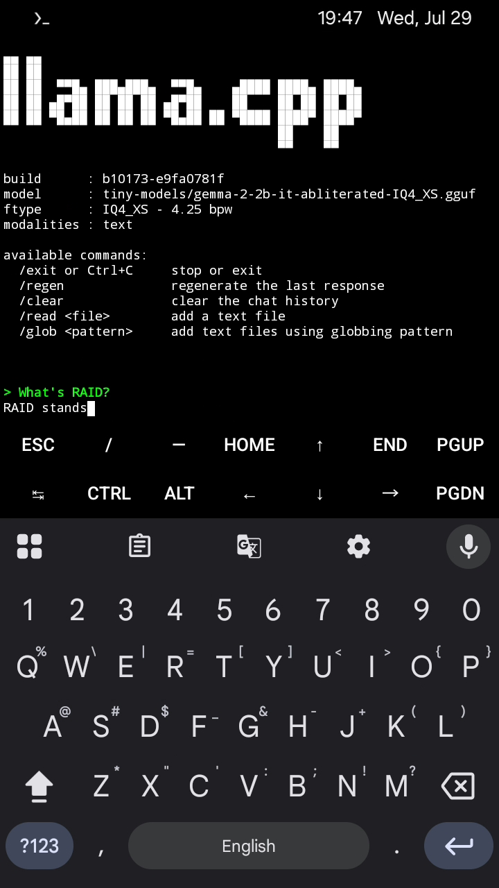

# Run offline AI models on 32-bit Android phones with Termux.




- llama.cpp Prebuilt Binaries for Termux (32-bit ARM)
- Prebuilt **llama.cpp** binaries compiled for **Termux on ARMHF (armeabi-v7a / armv8l)** Android devices.

This project provides prebuilt llama.cpp binaries that allow you to run GGUF models (such as TinyLlama and Gemma) locally on 32-bit Android devices using Termux.

## Compatibility

- **Works on:** Termux (ARMHF / 32-bit Android)

This binary was compiled inside Termux and links against Android’s Bionic libc.

## Features

- `llama-cli` (interactive chat)
- `llama-server` (OpenAI-compatible server)
- Other useful tools included in the `bin` folder

## How to Use

1. Download this repository or just the `bin` folder.

```bash
git clone https://github.com/evrenater/llama.cpp-termux-armhf.git
cd llama.cpp-termux-armhf
```

2. Give execute permission:

```bash
chmod +x bin/*
```

## Download a Model
- Gemma (smarter):
```bash
wget -c "https://huggingface.co/bartowski/gemma-2-2b-it-abliterated-GGUF/resolve/main/gemma-2-2b-it-abliterated-IQ4_XS.gguf?download=true"
```

- TinyLlama (faster):
```bash
wget -c "https://huggingface.co/hieupt/TinyLlama-1.1B-Chat-v1.0-Q4_K_M-GGUF/resolve/main/tinyllama-1.1b-chat-v1.0-q4_k_m.gguf?download=true"
```

## Run a Model

```bash
./bin/llama-cli \
  -m model-path/model-name.gguf \
  -c 512 \
  -t 8 \
  -n 512 \
  -ngl 0 \
  -cnv \
  --color on
```

## Recommended Settings for Low-End Phones
- Context size (-c): 256 or 512
- Threads (-t): maybe 4
- GPU offloading is unavailable on this build, so use -ngl 0.


## Notes
- Models are not included. You need to download GGUF models separately (e.g. from Hugging Face).
- Successfully tested on Samsung Galaxy M13 with these models:
  - [Gemma](https://huggingface.co/bartowski/gemma-2-2b-it-abliterated-GGUF/blob/main/gemma-2-2b-it-abliterated-IQ4_XS.gguf)
  - [TinyLlama](https://huggingface.co/hieupt/TinyLlama-1.1B-Chat-v1.0-Q4_K_M-GGUF/blob/main/tinyllama-1.1b-chat-v1.0-q4_k_m.gguf)
- This is an unofficial prebuilt binary.

## Build Information
- Built with llama.cpp
- Target: ARMHF (armeabi-v7a)
- Environment: Termux

## Credits
[llama.cpp](https://github.com/ggerganov/llama.cpp) by Georgi Gerganov and contributors

## License
This repository contains prebuilt binaries of llama.cpp.
See the upstream project's license for source code licensing.

## Keywords
llama.cpp, Termux, ARMHF, armeabi-v7a, 32-bit Android, offline AI, GGUF, llama-cli
